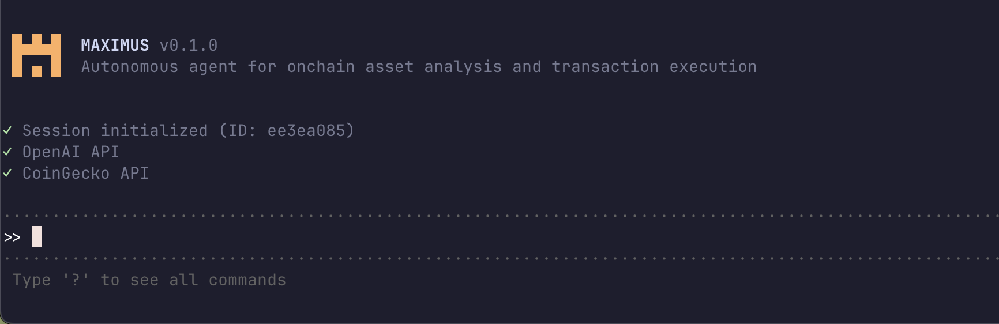

# Maximus 🤖

Maximus is an autonomous agent for onchain asset analysis and transaction execution. It thinks, plans, and learns as it works, performing comprehensive analysis using task planning, self-reflection, and real-time market data. Think Claude Code, but built specifically for onchain operations.




## Overview

Maximus takes complex onchain tasks and turns them into clear, step-by-step execution plans. It runs those tasks using live market data, checks its own work, and refines the results until it has a confident, data-backed outcome.  

It's not just another chatbot. It's an agent that plans ahead, verifies its progress, and keeps iterating until the job is done—whether that's analyzing assets or executing transactions.

**Available as:**
- 🖥️ **Native Desktop App** - Beautiful Tauri-based native app (macOS, Windows) - [See DESKTOP_APP.md](./DESKTOP_APP.md)
- 💻 **Terminal CLI** - Fast command-line interface (installation below)
- 🌐 **Web Dashboard** - Next.js wallet management interface

**Key Capabilities:**
- **Intelligent Task Planning**: Automatically decomposes complex queries into structured execution steps
- **Autonomous Execution**: Selects and executes the right tools for analysis and transaction operations
- **Self-Validation**: Checks its own work and iterates until tasks are complete
- **Conversational Memory**: Remembers past queries within a session using Capi memory API
- **Real-Time Asset Data**: Access to prices, market data, OHLC charts, and asset information from CoinGecko
- **Solana Integration**: Connect wallets via web dashboard and query on-chain data directly from terminal

[](https://twitter.com/stevensarmi_)

### Prerequisites

- Python 3.10 or higher
- [uv](https://github.com/astral-sh/uv) package manager
- OpenAI API key (get [here](https://platform.openai.com/api-keys))
- CoinGecko Pro API key (get [here](https://www.coingecko.com/en/api/pricing))
- Capi API key for memory (get [here](https://capi.dev/sign-up)) - Optional but recommended
- Helius RPC API key for Solana features (get [here](https://helius.dev)) - Optional
- Titan API token for token swaps (contact info@titandex.io) - Required for swap functionality

### Installation

1. Clone the repository:
```bash
git clone https://github.com/stevesarmiento/maximus.git
cd maximus
```

2. Install TA-Lib system dependencies (required for technical indicators):
```bash
# macOS
brew install ta-lib

# Ubuntu/Debian
sudo apt-get install ta-lib

# Or install from source: https://github.com/TA-Lib/ta-lib-python
```

3. Install Python dependencies with uv:
```bash
uv sync
```

4. Set up your environment variables:
```bash
# Copy the example environment file
cp .env.example .env

# Edit .env and add your API keys
# OPENAI_API_KEY=your-openai-api-key
# COINGECKO_API_KEY=your-coingecko-api-key
# CAPI_API_KEY=your-capi-api-key (optional, for conversational memory)
# HELIUS_RPC_URL=https://mainnet.helius-rpc.com/?api-key=your-api-key (optional, for Solana)
# TITAN_API_TOKEN=your-titan-api-token (required for token swaps, contact info@titandex.io)
# TITAN_WS_URL=wss://us1.api.demo.titan.exchange/api/v1/ws (optional, defaults to US endpoint)
```

### Usage

Run Maximus in interactive mode:
```bash
uv run maximus
```

### Example Queries

Try asking Maximus questions like:

**Market Data:**
- "What is Bitcoin's current price and market cap?"
- "Compare the 30-day price performance of Ethereum and Solana"
- "What are the top 10 cryptocurrencies by market cap?"
- "Show me the 7-day OHLC data for BTC"
- "What are the trending cryptocurrencies right now?"
- "Get detailed information about Cardano"

**Technical Analysis:**
- "Analyze Bitcoin using technical signals"
- "What do the signals show for SOL over 30 days?"
- "Show me the trading signals for ETH"
- "Is BTC overbought or oversold?"
- "What are the WaveTrend and RSI levels for Ethereum?"

**Autonomous Trading (requires delegation setup):**
- "Execute strategy for Solana in dry run mode" - Simulates trade with calculated position size
- "Should I buy ETH based on signals?" - Gets strategy recommendation
- "Analyze SOL with strategy engine" - Complete analysis with entry signals and position sizing
- ⚠️ **Always test with dry_run=True first before live trading!**
- 📖 See [AUTONOMOUS_TRADING_GUIDE.md](AUTONOMOUS_TRADING_GUIDE.md) for complete documentation

**Solana Wallets (requires web dashboard setup):**
- `/balances` - Show wallet balances instantly
- `/transactions` - Show recent transactions
- "What tokens are in my wallet?"
- "Show me my recent Solana transactions"
- "What's my SOL balance?"

**Solana Transactions (requires delegation setup):**
- "Send 0.5 SOL to <address>" - Executes real SOL transfers
- "Swap 10 USDC for SOL" - Executes real token swaps via Titan
- "Transfer tokens to another wallet" - Executes token transfers
- `/delegate` - View delegation status
- `/revoke` - Revoke delegation

⚠️ **Warning:** These execute real on-chain transactions with real money!

Maximus will automatically:
1. Break down your request into actionable tasks
2. Fetch the necessary onchain data
3. Perform calculations and analysis
4. Provide a comprehensive, data-rich response

### Memory Feature

Maximus has conversational memory powered by Capi, allowing it to remember and reference past interactions within a session:

**Follow-up questions:**
```
>> What's the 24h trading volume for BTC and SOL?
[... Maximus provides the data ...]

>> repeat the last data points to me
[... Maximus recalls and repeats the previous answer ...]

>> what about Ethereum?
[... Maximus understands the context and fetches Ethereum's trading volume ...]
```

**Memory commands:**
- `/clear` - Delete all memories from the current session using Capi's forgetMemory API
- `exit` or `quit` - Exit Maximus (memories are automatically deleted)

**Note:** Memory is session-based. Each time you start Maximus, you get a fresh session with no memory from previous runs. When you exit or use `/clear`, memories are permanently deleted from Capi's storage.

### Solana Wallet Integration

Maximus can query your Solana wallets for balances, tokens, and transaction history:

**Setup:**
1. Start the web dashboard:
   ```bash
   cd web
   npm install
   npm run dev
   ```

2. Open [http://localhost:3000](http://localhost:3000) in your browser

3. Click "Connect Wallet" and approve the connection in your browser extension

4. Your wallet is now approved! Return to the Maximus terminal

**Terminal Commands:**
- `/balances` - Show SOL and token balances for all approved wallets
- `/transactions` - Show recent transaction history
- Natural language: "What's in my wallet?", "Show my recent transactions"

**How it works:**
- Wallets are stored in `~/.maximus/wallets.json`
- Only public keys are stored (never private keys)
- Terminal queries on-chain data via Helius RPC
- Web dashboard manages wallet approvals securely

### Transaction Signing with Delegation

Maximus can autonomously sign transactions within delegated limits:

**Setup:**
1. Visit [http://localhost:3000/delegate](http://localhost:3000/delegate)

2. Connect your wallet and set limits:
   - Max SOL per transaction (e.g., 1.0 SOL)
   - Max tokens per transaction (e.g., 100)
   - Duration (e.g., 24 hours)

3. Create a password to encrypt the delegate wallet

4. Delegation saved! Terminal can now sign transactions

**Usage:**
```bash
# Check delegation
>> /delegate

# Send SOL
>> Send 0.5 SOL to <address>

# Swap tokens
>> Swap 25 USDC for SOL

# Revoke delegation
>> /revoke
```

**Security:**
- Delegate wallet encrypted with your password
- Time-limited (expires automatically)
- Spending limits enforced
- Revocable at any time
- See [DELEGATION_GUIDE.md](DELEGATION_GUIDE.md) for details

### Token Swaps with Titan Router

Maximus uses Titan's WebSocket-based swap API to provide live streaming quotes from multiple providers and executes real swaps on-chain:

**Features:**
- **Live Quote Streaming**: Real-time quotes from Jupiter aggregator, Pyth Express Relay, Hashflow, and other providers
- **Interactive UI**: Live-updating table showing routes, prices, and rates from all providers
- **Best Execution**: Automatically highlights the best quote by output amount
- **User Confirmation**: Press Enter to execute the best quote, or Ctrl+C to cancel
- **On-Chain Execution**: Signs and sends transactions to Solana network
- **Transaction Confirmation**: Waits for confirmation and provides Solscan link

**How it works:**
1. Agent connects to Titan WebSocket API
2. Streams live quotes continuously (updates every 500ms)
3. Displays an in-place updating table showing:
   - Provider name
   - Route (e.g., "Raydium → Orca → Jupiter")
   - Input/output amounts
   - Exchange rate
4. Best quote highlighted in green with ★ indicator
5. User presses Enter to confirm and execute
6. Transaction signed by delegate wallet
7. Sent to Solana network and confirmed
8. Transaction signature and Solscan link returned

**Example:**
```bash
>> Swap 10 USDC for SOL

╭─ Live Quotes
│ Provider        Route                In USDC      Out SOL      Rate
│ ───────────────────────────────────────────────────────────────────────
│ ★ Jupiter       Raydium → Orca       10.0000      0.0987       0.0987
│   Pyth Express  Direct               10.0000      0.0985       0.0985
│   Hashflow      Direct               10.0000      0.0983       0.0983
│
╰───────────────────────────────────────────────────────────────────────

Press Enter to execute best quote, or Ctrl+C to cancel

# After pressing Enter:
💫 Executing swap via Jupiter...
📤 Sending transaction to Solana...
⏳ Waiting for confirmation...
✅ Swap executed successfully!
   Transaction: 5K7Qp...abc123
   View on Solscan: https://solscan.io/tx/5K7Qp...abc123
```

**Prerequisites:**
- Delegate wallet must have the tokens you want to swap
- Transfer tokens to delegate address (shown at startup), or
- Use token delegation via `/approve-token` (experimental)

## Architecture

Maximus uses a multi-agent architecture with specialized components:

- **Planning Agent**: Analyzes requests and creates structured task lists
- **Action Agent**: Selects appropriate tools and executes operations
- **Validation Agent**: Verifies task completion and data sufficiency
- **Answer Agent**: Synthesizes findings into comprehensive responses

## Available Tools

Maximus has access to the following onchain data and analysis tools:

**Price Data:**
- `get_price_snapshot`: Current price, market cap, volume, and 24h changes
- `get_historical_prices`: Historical price data over specified time periods
- `get_ohlc_data`: OHLC candlestick data for technical analysis

**Market Overview:**
- `get_top_cryptocurrencies`: Top cryptocurrencies ranked by market cap or volume
- `get_global_market_data`: Global crypto market statistics and metrics
- `get_trending_coins`: Currently trending cryptocurrencies

**Coin Information:**
- `get_coin_info`: Detailed information about a cryptocurrency project
- `search_cryptocurrency`: Search for cryptocurrencies by name or symbol

**Technical Analysis:**
- `analyze_signals`: Complete technical analysis including WaveTrend Channel, Money Flow, RSI, Stochastic RSI, divergence detection, and aggregated trading signals
- `execute_strategy`: Autonomous strategy execution that analyzes Maximus signals and automatically calculates position sizes, risk levels, and executes trades based on predefined strategy parameters

**Solana Blockchain:**
- `get_wallet_balances`: Get SOL and SPL token balances for approved wallets
- `get_transaction_history`: Fetch recent transaction history
- `get_token_accounts`: Get detailed token account information
- `send_sol`: Send SOL using delegated wallet
- `send_token`: Send SPL tokens using delegated wallet
- `swap_tokens`: Swap tokens via Titan router with live streaming quotes

## Project Structure

```
maximus/
├── assets/              # Images and visual assets
├── examples/            # Demo and integration examples
├── tests/               # Test files
├── src/
│   └── maximus/
│       ├── agent.py      # Main agent orchestration logic
│       ├── model.py      # LLM interface
│       ├── prompts.py    # System prompts for each component
│       ├── schemas.py    # Pydantic models
│       ├── tools/        # Onchain data and analysis tools
│       │   ├── api.py    # CoinGecko API client
│       │   ├── prices.py # Price and OHLC data tools
│       │   ├── market.py # Market overview tools
│       │   ├── memory.py # Capi memory integration
│       │   ├── info.py   # Asset information tools
│       │   ├── technical_indicators.py # Maximus technical signals
│       │   ├── solana.py # Solana blockchain tools
│       │   └── solana_client.py # Helius RPC client wrapper
│       └── utils/        # Utility functions
│           ├── charts.py
│           ├── command_palette.py
│           ├── intro.py
│           ├── logger.py
│           ├── status_bar.py
│           ├── ui.py
│           └── wallet_storage.py # Wallet configuration management
├── web/                 # Web dashboard for wallet management
│   ├── app/             # Next.js app router
│   ├── components/      # React components
│   └── package.json
├── .env.example
├── pyproject.toml
└── uv.lock
```

## Configuration

Maximus supports configuration via the `Agent` class initialization:

```python
from maximus.agent import Agent

agent = Agent(
    max_steps=20,              # Global safety limit
    max_steps_per_task=5       # Per-task iteration limit
)
```

## How to Contribute

1. Fork the repository
2. Create a feature branch
3. Commit your changes
4. Push to the branch
5. Create a Pull Request

**Important**: Please keep your pull requests small and focused.  This will make it easier to review and merge.

## Troubleshooting

### Memory Not Working

If you're seeing Capi API calls in your dashboard but memory doesn't seem to be working:

1. **Check API Key**: Ensure `CAPI_API_KEY` is set in your `.env` file
2. **Check Debug Output**: Look for memory-related logs:
   - `💾 Session initialized with memory` - Session started successfully
   - `💾 Memory saved successfully` - Memory was stored
   - `💾 Retrieved X relevant memory item(s)` - Memories were found
3. **Wait for Embedding**: Capi needs a moment to embed memories. Try:
   - Ask a question and get an answer
   - Wait 1-2 seconds
   - Ask a follow-up question that references the previous one
4. **Test with Simple Query**:
   ```
   >> What is the price of Bitcoin?
   [wait for answer]
   >> repeat that
   [should recall the Bitcoin price]
   ```

If you see warnings like `⚠️ Memory storage disabled` or `⚠️ Failed to store memory`, check your API key and network connection.

### Connection Issues

If you encounter connection errors, try:
- Check your internet connection
- Verify your API keys are valid
- Try again in a few moments (API rate limits)

## License

This project is licensed under the MIT License.

